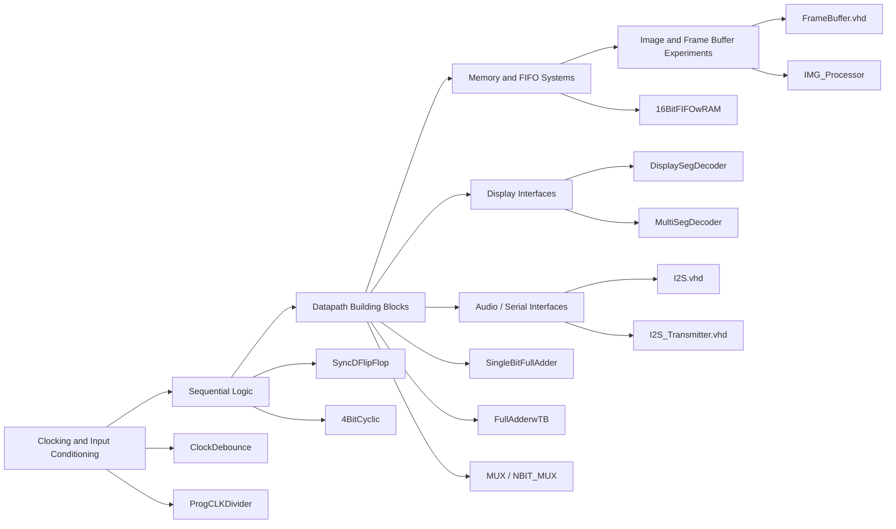
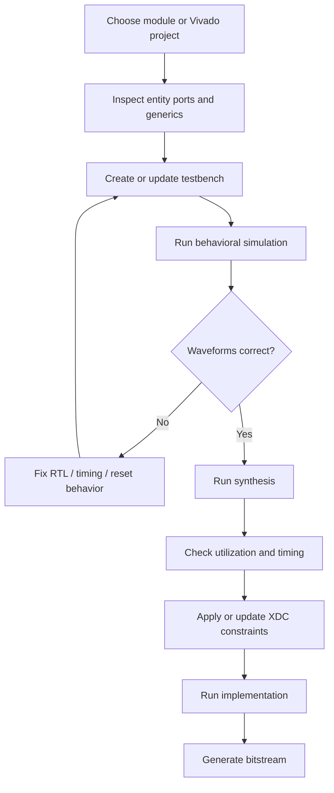

<div align="center">

# FPGA Hardware Design — VHDL Branch

### A curated collection of VHDL-based digital logic, FPGA building blocks, and Vivado projects


</div>

---

## Overview

`FPGAHardwareDesign` is a VHDL-focused hardware design repository containing a mixture of standalone RTL modules, educational digital-design experiments, and complete Xilinx Vivado project directories. The `VHDL` branch captures practical FPGA development work ranging from simple combinational logic to sequential systems, clocking utilities, memory-backed designs, seven-segment display logic, FIFO/RAM workflows, and serial audio output through I²S.

This branch is especially useful as a portfolio-style reference for learning and demonstrating:

- VHDL entity/architecture structure
- FSM-based sequential design
- Clock division and clock-domain-style timing control
- Full-adder and mux-based combinational logic
- D flip-flop and synchronous storage behavior
- FIFO/RAM-oriented datapath design
- Seven-segment display decoding
- Basic image/frame-buffer memory experiments
- I²S-style serial audio transmission
- Vivado project organization for Artix-7 FPGA targets

---

## Repository Philosophy

This repository is not just a set of isolated HDL snippets. It preserves both:

1. **Standalone VHDL modules** for compact review, reuse, and simulation.
2. **Full Vivado project folders** for designs that depend on constraints, IP metadata, generated project context, or board-level implementation settings.

That makes the branch useful in two different ways:

- As a **source-code library** for studying individual VHDL modules.
- As a **Vivado project archive** for reopening, modifying, synthesizing, and implementing FPGA designs.

---

## High-Level Architecture Map



---

## Repository Structure

```text
FPGAHardwareDesign/
├── 16BitFIFOwRAM/          # Vivado project for FIFO/RAM-oriented design work
├── 4BitCyclic/             # Vivado project for a cyclic 4-bit sequential design
├── ClockDebounce/          # Vivado project for clock/input conditioning logic
├── DisplaySegDecoder/      # Seven-segment display decoding project
├── FullAdderwTB/           # Full-adder design with testbench-oriented structure
├── IMG_Processor/          # Image/frame-buffer processing experiments
├── MultiSegDecoder/        # Multi-digit seven-segment display decoder project
├── ProgCLKDivider/         # Programmable clock-divider project
├── SingleBitFullAdder/     # Minimal full-adder building block project
├── SyncDFlipFlop/          # Synchronous D flip-flop project
├── FrameBuffer.vhd         # Memory/frame-buffer VHDL draft using file initialization
├── I2S.vhd                 # I²S top-level controller using transmitter + ROM source
├── I2S_Transmitter.vhd     # FSM-based I²S serial transmitter
├── MUX.vhd                 # Single-bit mux logic module
├── NBIT_MUX.vhd            # Generated/vector mux structure
└── README.md
```

---

## Project Catalog

| Path | Type | Description |
|---|---:|---|
| `16BitFIFOwRAM/` | Vivado project | FIFO and RAM-centered FPGA design project. Includes imported VHDL sources, memory/FIFO IP context, and an Artix-7 Vivado project configuration. |
| `4BitCyclic/` | Vivado project | Sequential 4-bit cyclic logic design. Useful for studying counters, state progression, and clocked behavior. |
| `ClockDebounce/` | Vivado project | Clock/input-conditioning design area with mux-style logic and simulation sources. Useful for button conditioning, debouncing concepts, and timing cleanup. |
| `DisplaySegDecoder/` | Vivado project | Seven-segment display decoder project for mapping binary or encoded values onto display segment outputs. |
| `FullAdderwTB/` | Vivado project | Full-adder design packaged with testbench-style verification structure. |
| `IMG_Processor/` | Vivado project | Image-processing-oriented FPGA project area, likely paired with memory/frame-buffer experimentation. |
| `MultiSegDecoder/` | Vivado project | Multi-digit seven-segment display decoding project for driving multiple display positions. |
| `ProgCLKDivider/` | Vivado project | Programmable clock divider project for deriving slower timing enables or output clocks from a faster FPGA clock. |
| `SingleBitFullAdder/` | Vivado project | Basic single-bit full adder implementation. Useful as a minimal combinational-logic reference. |
| `SyncDFlipFlop/` | Vivado project | Synchronous D flip-flop design project for clocked storage and reset/set behavior experiments. |
| `FrameBuffer.vhd` | Standalone VHDL | Experimental memory-backed frame-buffer module using generic address width, data width, image size, and file-based initialization. |
| `I2S.vhd` | Standalone VHDL | Top-level I²S audio controller that divides the master clock, reads sample data from a ROM-style source, and feeds an I²S transmitter. |
| `I2S_Transmitter.vhd` | Standalone VHDL | FSM-based transmitter that loads a stereo-width word and serializes it over `SD` while generating `LRCLK` and gated `SCLK`. |
| `MUX.vhd` | Standalone VHDL | Single-bit mux-style module intended as a small combinational building block. |
| `NBIT_MUX.vhd` | Standalone VHDL | Generator-based vector/chained mux structure for scaling mux logic across multiple bits or stages. |

---

## Standalone RTL Highlights

### I²S Audio Path

The I²S design is split into two clean conceptual layers:

```text
MCLK
 │
 ▼
I2S.vhd
 ├── clock-ratio divider
 ├── ROM address/sample sequencing
 └── I2S_Transmitter.vhd
      ├── load word
      ├── shift serial data
      ├── generate LRCLK
      └── output SCLK / SD
```

`I2S.vhd` acts as the top-level controller. It divides the incoming master clock into an internal serial clock, reads sample data from a ROM-style component, packs the transmit word, and coordinates with the transmitter through a `Ready` handshake.

`I2S_Transmitter.vhd` is the low-level serial engine. It uses a small finite-state machine to load a `2 * WIDTH` transmit word, shift out the MSB-first serial data stream, toggle the left/right channel clock, and indicate when it is ready for the next sample.

---

### Memory and Image Buffering

`FrameBuffer.vhd` represents an experimental generic memory block for image or frame-buffer-style data. Its design intent is to parameterize:

- address width
- data width
- image size
- initialization file name
- read enable
- write enable
- independent read/write addresses

This is a useful foundation for later FPGA image-processing pipelines where pixel data must be staged in RAM-like storage before being filtered, displayed, transmitted, or otherwise processed.

---

### Combinational Logic Building Blocks

The mux and full-adder projects form the lower-level logic foundation of the branch.

These modules are helpful for:

- reviewing Boolean equations
- learning structural VHDL composition
- testing entity/component declarations
- building larger datapaths from primitive logic
- practicing testbench-driven verification

---

### Clocking and Sequential Logic

The clock divider, cyclic counter, debounce, and D flip-flop projects focus on timing-oriented digital logic. These are essential FPGA design fundamentals because most real hardware systems depend on clean clocked behavior, deterministic state transitions, and safe handling of external inputs.

---

## Toolchain

The Vivado project files in this branch are configured around:

| Item | Value |
|---|---|
| FPGA toolchain | Xilinx Vivado 2020.2 |
| HDL target language | VHDL |
| Simulator language | VHDL |
| Example FPGA part | `xc7a35tcpg236-1` |
| Typical board family | Artix-7 / Basys 3 style projects |

Newer Vivado versions may be able to upgrade the projects automatically, but for best reproducibility, open the original projects using Vivado 2020.2 or a close compatible version first.

---

## Getting Started

### 1. Clone the VHDL branch

```bash
git clone --branch VHDL --single-branch https://github.com/MaximusNwider/FPGAHardwareDesign.git
cd FPGAHardwareDesign
```

### 2. Open a Vivado project

For a complete project folder, open the `.xpr` file directly:

```bash
vivado 16BitFIFOwRAM/16BitFIFOwRAM.xpr
```

or open Vivado manually and select:

```text
File → Project → Open → <project-name>.xpr
```

Examples:

```text
16BitFIFOwRAM/16BitFIFOwRAM.xpr
4BitCyclic/4BitCyclic.xpr
ClockDebounce/ClockDebounce.xpr
```

### 3. Run the normal FPGA flow

Inside Vivado:

```text
Open Project
  → Review Sources
  → Run Behavioral Simulation
  → Run Synthesis
  → Run Implementation
  → Generate Bitstream
```

### 4. Use standalone VHDL modules

Standalone files can be added to a new Vivado project:

```text
Add Sources
  → Add or Create Design Sources
  → Select .vhd file
  → Set top module if needed
```

For quick linting/simulation experiments with an external VHDL toolchain, use a VHDL-2008-capable simulator such as GHDL:

```bash
ghdl -a --std=08 I2S_Transmitter.vhd
ghdl -e --std=08 I2S_Transmitter
```

For modules that instantiate other components, add every required dependency before elaboration.

---

## Suggested Development Workflow



---

## Recommended Verification Checklist

Before treating any module as implementation-ready, verify the following:

- [ ] Entity ports match the intended top-level integration.
- [ ] Reset polarity is documented and tested.
- [ ] Clock edges are used consistently.
- [ ] All instantiated components are present in the project.
- [ ] Generics have valid default values.
- [ ] Testbench covers reset, nominal operation, and edge cases.
- [ ] Synthesis completes without unintended latch inference.
- [ ] Timing constraints exist for every real input clock.
- [ ] Pin constraints match the actual FPGA board.
- [ ] Simulation behavior matches expected hardware behavior.

---

## Notes on Generated Vivado Content

Some directories preserve full Vivado project state, including generated folders such as:

```text
*.cache/
*.gen/
*.hw/
*.ip_user_files/
*.runs/
*.srcs/
*.xpr
```

This is useful when reopening the design exactly as it existed in Vivado, especially for projects involving IP cores or generated metadata.

For a cleaner source-only repository, a future cleanup pass could keep only:

```text
*.xpr
*.srcs/sources_1/
*.srcs/constrs_1/
*.srcs/sim_1/
relevant .xci IP files
README.md
```

and ignore build outputs such as runs, caches, logs, and temporary simulator data.

---

## Possible Future Improvements

This branch could be strengthened further by adding:

- dedicated README files inside each project folder
- waveform screenshots for key simulations
- a consistent `sim/` directory convention
- a consistent `src/` directory convention
- standardized testbench naming
- synthesis/simulation status badges
- a `.gitignore` tuned for Vivado-generated artifacts
- cleaned top-level module naming
- comments documenting reset behavior and clock assumptions
- a `LICENSE` file for reuse permissions

---

## Educational Value

This branch demonstrates a broad slice of practical FPGA design fundamentals:

```text
Basic gates and muxing
        ↓
Adders and datapath primitives
        ↓
Flip-flops and synchronous logic
        ↓
Counters and clock division
        ↓
Display drivers
        ↓
Memory/FIFO structures
        ↓
Frame-buffer and image concepts
        ↓
Serial audio transmission
```

That progression makes the repository valuable as a digital-design learning archive, a VHDL reference set, and a portfolio artifact for FPGA/RTL development.

---

## Author

Created and maintained by **Maximus Nwider**.

Repository: `MaximusNwider/FPGAHardwareDesign`  
Branch: `VHDL`
